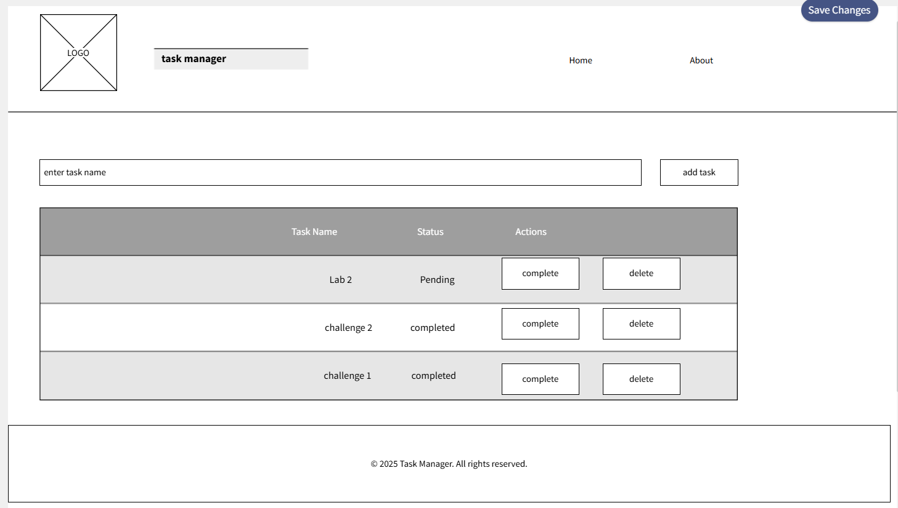
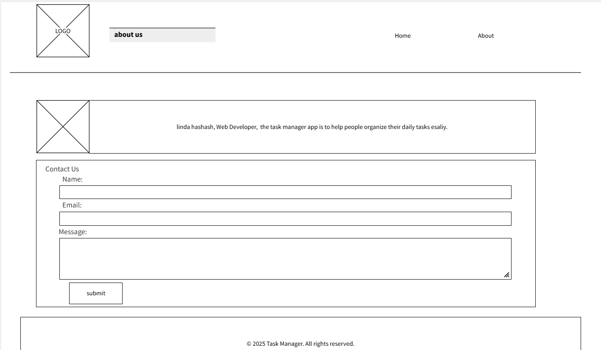

# My-Tasks

1. what observations or questions do you have about what you've learned so far?
 it's great, i learned how to create html structures and format with css

2. how long did it take you to complete this assignment? and how long did you expct it to take?
i expected 2 hours but it took 4 hours

## index.html wireframe:

## about.html wireframe:

